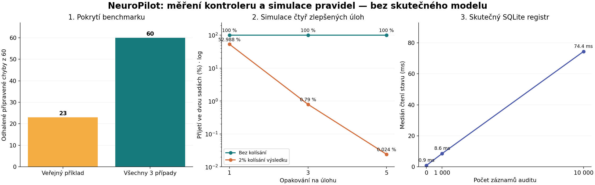

# NeuroPilot: co ukázal výzkum verze 3.3.0

**Výsledek:** kontroler má funkční základ pro řízené experimenty, ale původní hodnotitel obsahoval reprodukovatelné chyby a současné rozhodovací brány mohou být příliš necitlivé ke kolísavému zlepšení. Opravy jsou ve verzi **3.3.1**. Skutečné sebezdokonalení modelového agenta jsme neprokázali.

Datum: 4. října 2026, Europe/Prague. Výchozí archiv: `baseline_3.3.0.zip`, SHA-256 `f976d6a33bcc9d8892d3f0caa2ef43c6d8bb8112cc092034299d59bb158c0a0d`. Protokoly obsahují také hash všech souborů implementace RSI a verzi Pythonu 3.12.14.

## 1. Rozsah a druhy důkazů

| Výzkum | Rozsah | Co skutečně měří |
|---|---|---|
| Kvalita benchmarku | 60 úloh, 180 původních případů, 3 534 dalších případů v šesti rodinách | Správnost autorských referencí a schopnost příkladů odhalit připravenou chybu |
| Citlivost schopnostní brány | 600 000 simulovaných scénářů | Rozhodování pravidla při zadaných pravděpodobnostech, nikoli výkon modelu |
| Citlivost tokenové brány | 200 000 simulovaných scénářů | Reakci na modelovaný šum ve spotřebě |
| Hraniční a nekorektní vstupy | 9 sond, sedm reprodukovaných problémů | Chování konkrétního kódu před opravami a po nich |
| Souběžnost a stabilita | 5 000 rezervací, 500 čtení stavu, 18 řízených výpadků | SQLite, správu rozpočtu a stav kontroleru; výpadky používají explicitní fixture provider |
| Škálování auditu | 0, 1 000 a 10 000 událostí, 20 měření na velikost | Latenci čtení registru na zdejším sdíleném počítači |
| Rešerše | Pět původních výzkumných prací | Kontext architektury a metodiky, nikoli nezávislou replikaci jejich výsledků |

**Žádný výsledek níže nepochází z inference skutečného modelu.** Ollama není nakonfigurována; Docker/Podman zde chybí a Bubblewrap neprošel kontrolou izolace. Nevypínali jsme izolaci, abychom získali zdánlivý úspěch. Na hostiteli se při výzkumu spouštěly pouze pevné autorské referenční a chybné funkce z dodaného katalogu; nikoli kód vytvořený modelem.



## 2. Benchmark odhaluje své chyby, ale je příliš malý pro silné závěry

Všech **60 referenčních řešení prošlo** a všech **60 připravených chybných řešení** selhalo alespoň v jednom ze tří případů. To potvrzuje vnitřní konzistenci původních příkladů, nikoli úplnost specifikace.

Jediný veřejný příklad odhalil jen **23 chyb z 60**. Zbývajících **37/60, tedy 61,7 %**, se projeví až ve skrytých případech. Skryté případy mají oprávněně prověřovat zobecnění, ale jediný veřejný případ poskytuje slabou diagnostickou zpětnou vazbu agentovi při opravě.

Dalších **3 534 případů** prošlo nezávisle napsanými aritmetickými kontrolami pro absolutní hodnotu, ořez do intervalu, součet, faktoriál, největší společný dělitel a zaokrouhlené dělení. Toto rozšíření ověřuje šest rodin, ne všechny úlohy.

Záměrný kontrolní program, který předem zná tabulku všech správných odpovědí, dosáhne **60/60** bez obecného řešení. Nejde o objevený únik dat do agenta: odpovědi jsme této kontrole vědomě dali. Výsledek ukazuje, proč tři pevné případy a známý veřejný katalog nestačí k důkazu zobecnění nebo nekontaminovaného měření.

**Dopad:** současný katalog je vhodný pro kontrolu mechanismu. Pro hodnocení programátorských schopností jsou potřeba nové projekty, širší okrajové případy, nezávislé oracles a závěrečné sady vytvořené mimo návrhovou smyčku.

## 3. Brána schopností může blokovat i přínosné kandidáty

Simulovali jsme 20 úloh v každé potvrzovací sadě, dvě nové stabilní výhry jako minimum, nulové regrese a nulovou nestabilitu. Validační a závěrečná sada jsou v simulaci nezávislé; návrh kandidáta a vývojová brána nejsou simulovány. Každá kombinace měla 50 000 opakování se společným reprodukovatelným RNG seedem 20261004.

| Modelovaný kandidát | Opakování na úlohu | Přijetí jednou sadou | Přijetí oběma sadami |
|---|---|---|---|
| Čtyři skutečné nové výhry, bez náhody | 3 | 100 % | 100 % |
| Čtyři zlepšené úlohy, 2% pravděpodobnost odchylky od typického výsledku | 1 | 72,946 % | 52,988 % |
| Stejný přínos a 2% kolísání | 3 | 8,930 % | 0,790 % |
| Stejný přínos a 2% kolísání | 5 | 1,812 % | 0,024 % |
| Úspěšnost každé úlohy roste z 50 % na 70 %, nezávislé pokusy | 3 | 0/50 000 | 0/50 000 |
| Žádný přínos, obě verze mají 50% úspěšnost | 1 | 0,338 % | 0,002 % |
| Žádný přínos, obě verze mají 50% úspěšnost | 3 | 0/50 000 | 0/50 000 |

U scénáře se 2% kolísáním má rodič deset úloh s pravděpodobností úspěchu 0,02 a deset s 0,98; kandidát změní čtyři z nízkých pravděpodobností na 0,98. Jde tedy o konkrétní umělý model přínosu, nikoli pravděpodobnosti naměřené u Ollamy.

Více opakování zde nemusí pomáhat: současné pravidlo zamítne kandidáta při jediné nestabilní úloze kdekoliv v sadě. S počtem opakování roste příležitost takovou nestabilitu zaznamenat. Nula pozorovaných přijetí v konečném vzorku neznamená matematicky nulovou pravděpodobnost.

**Dopad:** systém se může zastavit na stagnaci i při užitečném, ale proměnlivém kandidátovi. Prahy jsme na základě těchto simulací neuvolnili. Nejdřív potřebujeme změřit varianci skutečného providera a předem zvolit pravidlo pro „nedostatek důkazů“, dodatečné opakování a případnou statistickou bránu.

## 4. Tokenová úspora potřebuje kontrolu podmínek

Simulace tokenů drží všechny funkční výsledky správné a stabilní; mění pouze spotřebu. Používá lognormální šum se směrodatnou odchylkou logaritmu 0,3 a 60 měřených pokusů. Tato tabulka zachycuje **jednu** efektivnostní bránu, nikoli celý proces potvrzení ve dvou sadách.

| Skutečná úspora v modelu | Model šumu | Pozorované přijetí při prahu 15 % |
|---|---|---|
| 0 % | Nezávislý šum jednotlivých pokusů | 0,186 % |
| 10 % | Nezávislý šum jednotlivých pokusů | 15,148 % |
| 20 % | Nezávislý šum jednotlivých pokusů | 86,378 % |
| 0 % | Jeden společný náhodný faktor pro celé měření každé verze | 35,012 % |

Poslední řádek je zátěžový myšlenkový model korelované změny podmínek. Není to odhad chybovosti NeuroPilotu v praxi. Ukazuje, že součet velkého počtu vzájemně závislých pozorování sám o sobě nezajistí důvěryhodnou úsporu.

Celkem **320 scénářů** z rychlé vektorové simulace bylo křížově zkontrolováno přímo původními rozhodovacími funkcemi programu. Simulace není náhradou za reálné párované modelové běhy.

## 5. Nalezené a opravené chyby

| Sonda | Verze 3.3.0 | Verze 3.3.1 |
|---|---|---|
| Porovnání 10^12 a 10^12 + 1 | Chybně stejné kvůli float toleranci | Celá čísla se porovnávají přesně |
| Porovnání 10^400 se sebou | OverflowError | Korektně stejné |
| Výstup obsahuje ok=true, ale chybí value; očekává se null | Chybně splněno | Nesplněno, hodnota musí být explicitní |
| Model zadá cestu jako seznam místo textu | Neošetřený TypeError | Ošetřená chyba nástroje, agent může pokračovat |
| Interní rezervace −100 tokenů | Záporná spotřeba v registru | Odmítnuto před zápisem |
| Totožná úloha dostane jiné ID i název rodiny v jiné sadě | Import ji přijme | Obsahový duplikát se odmítne |
| Již spotřebovaná závěrečná úloha se přesune do vývojové sady | Dostane se k fixture providerovi | Běh se zastaví před prvním návrhovým voláním |

Sonda boolean versus číslo správně rozlišovala true a 1 už před opravou. K záporné rezervaci vedla přímá zátěžová sonda interního API; běžný Ollama adapter s platnou konfigurací takovou rezervaci neposílá. Netvrdíme tedy, že tuto chybu mohl běžný kandidát využít přes své nástroje.

Porovnání integer/float vyžaduje přesnou číselnou shodu; například 4 a 4.0 zůstávají stejné. Tolerance zůstává pro porovnání dvou konečných floatů. Doplněna je i kontrola chybného typu položky files při importu.

Opravy nemění pravděpodobnostní prahy přijetí. Sémanticky podobné úlohy, pozměněné specifikace a kontaminace vah modelu se tím automaticky neřeší. Historie starých registrů bez jednotlivých otisků úloh také vyžaduje ruční kontrolu.

## 6. Zátěž a provozní stabilita

V deseti zkouškách soutěžilo 32 vláken o rozpočet 50 rezervací po 100 tokenech. Z celkových **5 000 pokusů** registr povolil přesně **50 v každé zkoušce**, vždy se spotřebou 5 000 tokenů. Nebylo pozorováno překročení kvóty; všechny auditní řetězce zůstaly platné.

Po **500 opakovaných vytvořeních kontroleru a čteních stavu** zůstaly otevřené file descriptory na hodnotě **4 → 4**. Živá Python alokace vzrostla přibližně o 103 kB včetně seznamu časování a cache; to není důkaz nulového dlouhodobého úniku. Medián 29,50 ms zde zahrnuje konstrukci Engine, benchmark a aktivní tracemalloc, proto jej nelze přímo porovnávat s následující tabulkou samostatného čtení registru.

| Události auditu | Medián Registry.summary | P95 ze 20 vzorků |
|---|---|---|
| 0 | 0,92 ms | 1,30 ms |
| 1 000 | 8,58 ms | 11,35 ms |
| 10 000 | 74,44 ms | 78,95 ms |

Čtení stavu znovu ověřuje celý auditní řetězec; naměřený růst odpovídá rostoucí práci s historií. Na dlouhé kampaně doporučujeme samostatně měřit režii a případně zavést ověřené checkpointy. Žádná extrapolace na miliony událostí ani výkon tvého 8GB notebooku nebyla měřena.

V **18 scénářích** jsme vložili výpadek do 1., 3., 5., 10., 20. nebo 30. modelového volání, vždy třikrát. Každý běh skončil blocked a aktivní agent zůstal nezměněn. Toto měří řízení selhání pomocí náhradního providera, nikoli chování skutečné Ollamy nebo spotřebu GPU.

Po opravách prošlo **171 Python testů**, z toho 20 nových regresních případů pro nalezené problémy. Testy nejsou číslem úspěšnosti AI agenta.

## 7. Co říká související výzkum

**DGM [1] a SICA [2]** popisují vlastní změny kódu agentů a empirické měření. Obecný směr NeuroPilotu tedy má výzkumné předchůdce. DGM navíc používá archiv a hledání přes více větví; NeuroPilot dnes postupuje převážně po přijaté rodičovské linii a mění jediný kontextový modul. Výsledky těchto prací nelze převést na náš malý katalog ani použít jako důkaz výkonu NeuroPilotu.

**On the Fragility of Self-Improving Agents [3]** upozorňuje na varianci a pořadí úloh u dvou systémů s textovou pamětí. To je odlišná architektura; metodické poučení je však relevantní: opakovat celé studie, měnit pořadí a měřit citlivost, nikoli publikovat jen nejlepší běh.

**Reflections on Trusting Trust, Revisited [4]** uvádí příklady přenosu škodlivého chování z otrávených benchmarků do nových verzí agentů. Pro NeuroPilot z toho vyvozujeme potřebu kontroly původu a správnosti úloh: oddělený hodnotitel může být technicky nepozměněný a přesto měřit nesprávný cíl. Náš výzkum takový útok s reálným modelem neprovedl.

**AIDE² [5]**, preprint zveřejněný 22. září 2026, uvádí vícedenní běh a přenos výsledků na další benchmarky. To ilustruje rozsah důkazů potřebný pro silnější tvrzení. Není to záruka podobného výsledku u NeuroPilotu. U rešerše jsme ověřili původní abstrakty a u DGM také autorský popis; nejde o úplnou nezávislou replikaci ani systematický přehled celé literatury.

[1] Zhang et al., Darwin Gödel Machine, 2025. https://arxiv.org/abs/2505.22954 a https://sakana.ai/dgm/

[2] Robeyns, Szummer, Aitchison, A Self-Improving Coding Agent, 2025. https://arxiv.org/abs/2504.15228

[3] Ye et al., On the Fragility of Self-Improving Agents, 2026. https://arxiv.org/abs/2608.18066

[4] Roesner, Kohno, Reflections on Trusting Trust, Revisited, 2026. https://arxiv.org/abs/2609.17817

[5] Srikanth et al., Recursive self-improvement of AI research agents, 2026. https://arxiv.org/abs/2609.26457

## 8. Další rozhodnutí

1. Používat opravený hodnotitel 3.3.1. Nalezené chyby by mohly zkreslit experiment ještě před otázkou schopností modelu.
2. Na cílovém Linuxu připojit skutečnou Ollamu a ověřený sandbox. Změřit 10 úloh opakovaně a zaznamenat varianci, paměť a latenci.
3. Rozšířit diagnostické případy a připravit nové úlohy nad malými vícesouborovými projekty. Zachovat oddělení vývoje, validace a závěrečného auditu.
4. Před dalším potvrzovacím experimentem stanovit práci s nejistotou a rozpočet opakování. Současný přísný filtr není statisticky kalibrovaný důkaz.
5. Teprve potom provést více nezávislých A/B studií s čerstvými sadami. Bez jejich výsledků nelze rozhodnout, zda je rekurzivní autor užitečnější.

## 9. Jak výsledky zopakovat

Z kořene projektu, v aktivovaném Python prostředí:

```bash
python -m pip install -r requirements-dev.txt -r research/requirements.txt
unzip research/baseline_3.3.0.zip -d /tmp/neuropilot_baseline
python research/run_research.py --project /tmp/neuropilot_baseline/NeuroPilot_3.3.0_RSI --suite benchmark --output /tmp/benchmark.json
python research/run_research.py --project /tmp/neuropilot_baseline/NeuroPilot_3.3.0_RSI --suite gates --output /tmp/gates.json
python research/run_research.py --project /tmp/neuropilot_baseline/NeuroPilot_3.3.0_RSI --suite stress --output /tmp/stress.json
python research/run_research.py --project /tmp/neuropilot_baseline/NeuroPilot_3.3.0_RSI --suite robustness --output /tmp/before.json
python research/run_research.py --suite robustness --output /tmp/after.json
python -m pytest tests -q
```

Protokoly dodané relace jsou v results/. Časy, náhodná ID běhů a některé alokace se při opakování budou lišit. Simulace používá NumPy 2.3.5 a pevný seed. Výchozí archiv umožňuje nezávisle ověřit rozdíl před opravami a po nich. `build_report.py` obnoví graf a HTML z uložených výsledků a tohoto dokumentu; do modelových měření nezasahuje.
